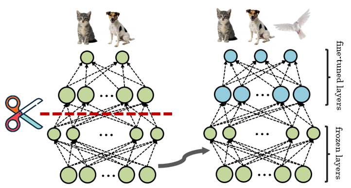
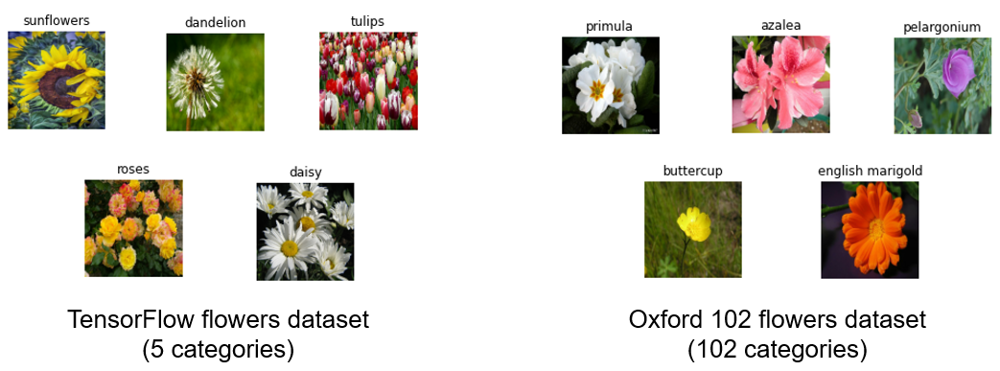
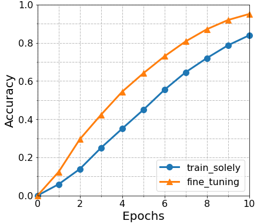

# Fine-tuning

A Tensorflow implementation of the **Fine-Tuning** for the flower image classification. 

---
## What is meant by Fine-tuning of neural network?

**Fine-tuning** is one approach of the **Transfer Learning** to **simplify the training process** and **make it time-efficient**. Traditional learning is isolated and occurs purely based on specific tasks, datasets. A model works well on the identical problem set but has to be rebuilt from scratch, once it encounters new feature distribution or new data categories. Since the process of deep learning is quite time-consuming, this strategy is not much preferable. But, what if we can make small adjustments to the pre-trained model to achieve desired performance on the different domain? 

The key idea here is to take weights of a trained model and use them for the initialization of a new model being trained on new data. In **Fine-tuning**, the new model just **leverage the pre-trained model’s weighted layers to extract features** but **not to update the weights of the model’s layers** during training with new data. We called the operation to prevent retraining weight as **freezing**, so the frozen layers are not going to be updated during backpropagation. Then we **cut off the rest and train the newly added layers**. 

Although some features in cat images (e.g., whiskers, paws, and so on) are mostly unrelated to birds, models trained on the *Cat vs Dog* dataset can extract general features that can help identify fur, eyes, and those animals' overall appearance. These similar features may be equally effective for recognizing a bird. This simple approach has been shown to achieve astounding results on an array of vision tasks. A model trained on ImageNet has been a preferable baseline model, and many researchers have examined how well this model solves the various set of tasks.

<p align="center"></p></br>

---
## Preparation

### Installing prerequisites

To install the prerequisite, simply type in the shell prompt the following:

```
$ pip install -r requirements.txt
```

You can use TensorFlow libraries with GPU support (See the guide at [TensorFlow tutorials](https://www.tensorflow.org/guide/gpu?hl=en)) to accelerate your code with CUDA back-end.

### Dataset

We prepared 2 different flower photo datasets:



* [TensorFlow flowers dataset (Flower5)](https://www.tensorflow.org/datasets/catalog/tf_flowers) : A dataset of 3670 photos of flowers. This dataset contains 5 sub-directories, one per class: daisy, dandelion, roses, sunflowers, and tulips.
* [Oxford 102 flowers dataset (Flower102)](https://www.robots.ox.ac.uk/~vgg/data/flowers/102/) : A dataset consisting of 102 flower categories. Each class consists of between 40 and 258 images.

Our goal is to train the baseline model with **Flower5** and transfer its pre-trained knowledge to the new model will be trained on the second dataset, **Flower102**.

---
## Result

You can run `test.ipynb` file to see how the fine-tuning mechanism speeds up the training of a large categorical dataset. 


